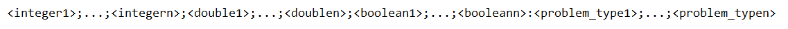
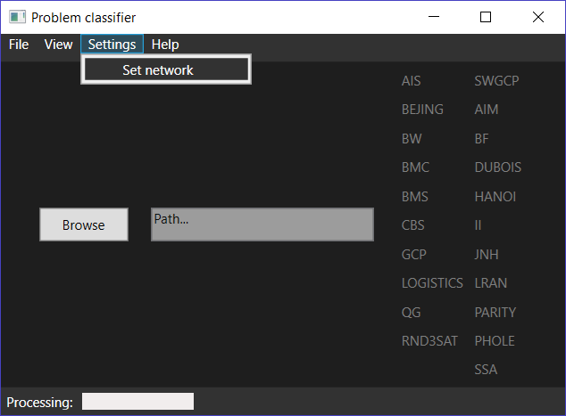
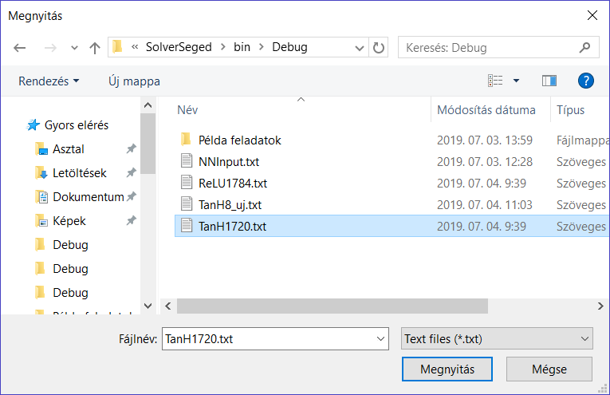
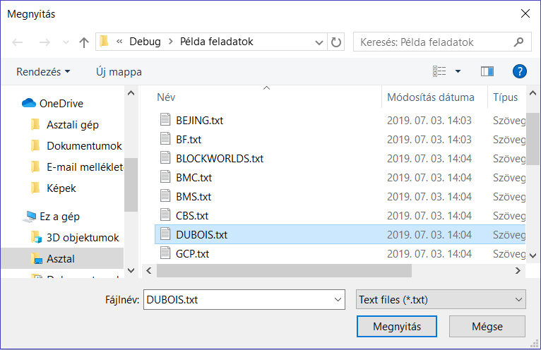
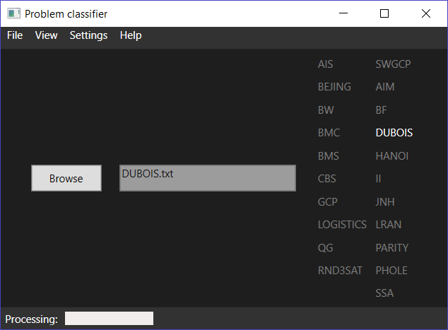
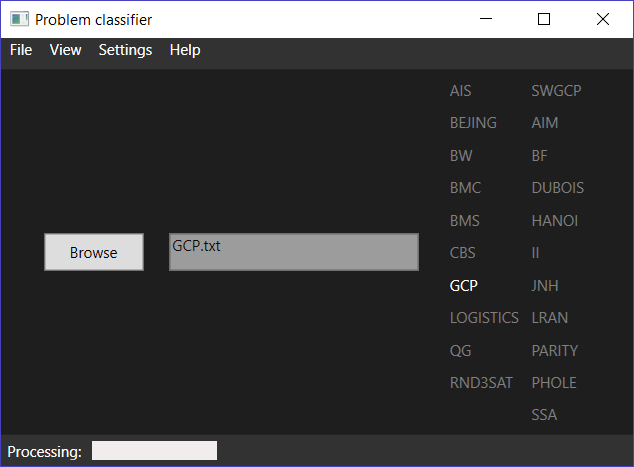
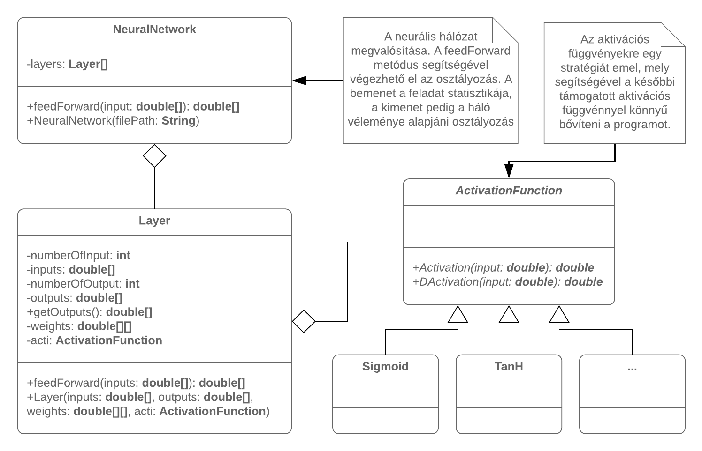

# EKE-PROBLEM-CLASSIFIER-WITH-NEURAL-NETWORK

Ez a projekt az Eszterházy Károly Egyetemmel együttműködve jött létre. A feladatom egy olyan szoftver lefejlesztése, mely egy problémáról előre kigyűjtött adatok alapján képes meghatározni annak a típusát ezáltal osztályozza azt. Ebben a repozitoriban nyomon követhető a munkám.

**Bemenet felépítése**

A neurális hálózat a feladatot az alábbi bemeneti formában tudja értelmezni:

Például: 48 ; 0 ; ... ; 78 ; 0,21 ; 0,5 ; ... ; 0,735 ; 0.0 ; 1.0 ; ... ; 0.0 : 0 ; 1 ; ... ; 0 (szóközök nélkül)

**Osztályozó program bemutatása**

Van lehetőségünk már betanított hálózatot beolvasni .txt állományból:

Ven lehetőségünk címke nélküli feladatot beolvasni .txt állományból:

A háló teljesítménye és a feladat típusa alapján a program besorolja a feladatot egy osztályba: 

**Cél**

A cél az, hogy amennyiben ezekben a környezetekben jól működik a program úgy az egészet át kell emelni néhány java metódusra.
Ez azt jelenti, hogy java nyelven kell implementálni a neurális hálózat osztályt és biztosítani kell azt, hogy egy .txt állományból egy betanított hálózatot be lehessen olvasni vele. Ezután egy olyan függvényt kell létrehozni, mely paraméterben egy probléma statisztikáját kapja és visszaadja a vélhetően helyes probléma típusát.

Mivel az előzően definiált környezeteken belül egész jól teljesít a hálózat, így elkészült a neurális hálózat java verziója is. Ez a verzió a tanulásra nem képes (nincs rá szüksége) de az adatfeldolgozásra igen. Kell tehát előre egy betanított hálózat a használatához. 
A java-s verzió UML ábrája:

